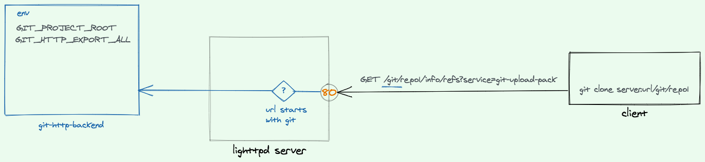

Git is the defacto version control system. Most of developers are familiar with it to some extent.
But most of us host their repositories in other people's servers.

For whichever reason or for none, let's create our own Git http server and let's host 
our code on our inf rastructure.

# Git http backend

> A simple CGI program to serve the contents of a Git repository to Git clients accessing the repository over http:// and https:// protocols.

What's CGI?

From wikipedia: 
> Common Gateway Interface (CGI) is an interface specification for web servers to execute programs that execute like console applications (also called command-line interface programs) running on a server that generates web pages dynamically.

Ok, now let's create our Git server using [lighttpd](https://www.lighttpd.net/)

### Creating our lighttpd server

Lighttpd is a fast web-server with a low memory footprint. It's installed in Ubuntu this way:
`apt-get install lighttpd lighttpd-doc`

### Creating a Git repo to test against

- `mkdir repo1 && cd repo1`
- `git init`

By default, `git http-backend` verifies that the directory has the
magic file `git-daemon-export-ok`, and it will refuse to export 
any Git directory that hasn't explicitly been marked for export this way.
In order to allow exporting all repos, we can set the environment variable `GIT_HTTP_EXPORT_ALL`.

- `touch git-daemon-export-ok`

Now we have a repo that we can use. 

Note that only `git` `pull`, `clone` and `fetch` are enabled by default.
In order to `git push`, the user needs to be authenticated. (more on that later)

### lighttpd Hello world!

First, install it `sudo apt install lighttpd`.

Visit `localhost:80` and you will see lighttpd home page.

Now that we have our server up and running, we can edit the config file.
It's found in `/etc/lighttpd/lighttpd.conf`.

#### Pro Tip
Before we do that, let's copy the initial conf and use a symbolic link for our server.
This way, we can have the config file in another folder and have it version controlled.

- `cd /etc/lighttpd`
- `mv lighttpd.conf lighttpd_initial.conf`. (It's never a good idea to delete stuff)
- `ln -s ~/server/git-server.conf lighttpd.conf`

#### Initial config
Here is the schema of the setup we will have



And here is the config of the lighttpd server.
```yaml
# default document-root
server.document-root = "/root"

 # TCP port
server.port = 80

  # selecting modules
server.modules = (
  "mod_access", "mod_rewrite", "mod_cgi",
  "mod_auth", "mod_setenv", "mod_alias",
  "mod_accesslog"
  )

# logs will be here. Very handy!
accesslog.filename = "/var/log/lighttpd.log"

# https://git-scm.com/docs/git-http-backend
# if the url starts with /git
# pass the right part of it to the command (git-http-backend)
alias.url += ( "/git" => "/usr/lib/git-core/git-http-backend" )

$HTTP["url"] =~ "^/git" {
  # handle all extensions 
  cgi.assign = ("" => "")
  setenv.add-environment = (
    "GIT_PROJECT_ROOT" => "/git_project_root_folder",
    "GIT_HTTP_EXPORT_ALL" => "",
    "REMOTE_USER" => "user"
    # this REMOTE_USER is required to enable push 
  )
}

```

- We exposed the server on the `80` port (default one).
- Then we added the required modules for git http-backend to work.
- We display the logs in a specified file.

The magical part is how we're using `mod_alias` and `mod_cgi` to  forward
all requests starting with `/git` to the command `git-http-backend`.

Let's try to clone our repo `git clone server.url/git/repo1`.
It works 🎉 If it doesn't work for you, check out the logs `vim /var/log/lighttpd.log`

Let's make some changes and `git push`.

Oops, here is the response we get 
```log
remote: error: refusing to update checked out branch: refs/heads/master
remote: error: By default, updating the current branch in a non-bare repository
remote: is denied, because it will make the index and work tree inconsistent
remote: with what you pushed, and will require 'git reset --hard' to match
remote: the work tree to HEAD.
remote:
remote: You can set the 'receive.denyCurrentBranch' configuration variable
remote: to 'ignore' or 'warn' in the remote repository to allow pushing into
remote: its current branch; however, this is not recommended unless you
remote: arranged to update its work tree to match what you pushed in some
remote: other way.
remote:
remote: To squelch this message and still keep the default behaviour, set
remote: 'receive.denyCurrentBranch' configuration variable to 'refuse'.
``` 

In Git, we cannot push to normal repos. Only bare repos accept pushes.

A bare repo is just a normal repo without a working tree. Meaning it only contains the contents of the `.git` folder.

We should init repos in our server using `git init --bare`, and that does the trick.
