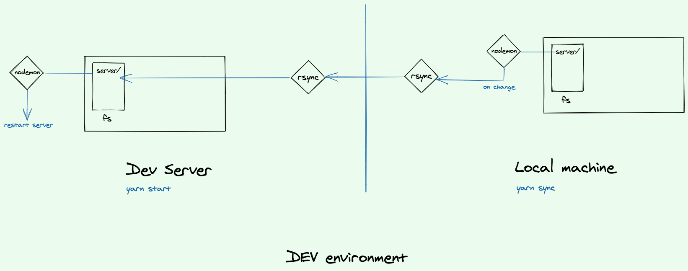

I'd like to work on my side project in an optimal way. 
And since i'm the only one working on it, it doesn't make sense to 
have multiple environments (dev, staging, pre-prod, prod) ...

Instead, i want to have only 2: dev & prod.
In order for this setup to be efficient, i need the dev environment to be no different than
the production one. 
That's why i never run the server app locally. 

And in order to keep my workflow fast, i came up with a beautiful setup:



In prose: `fswatch` watches for any changes in the server folder. When a file changes, `fswatch` calls `rsync` to copy the changed files to the server via ssh.
And we have `nodemon` watching for changes and restarting the server.

In code: my `package.json` file looks like this:
```json
{
  "scripts": {
    "sync": "nodemon --exec rsync -azP --exclude=node_modules . root@server_address:server_folder",
    "start": "nodemon --exec babel-node index.js"
  }
}
``` 
